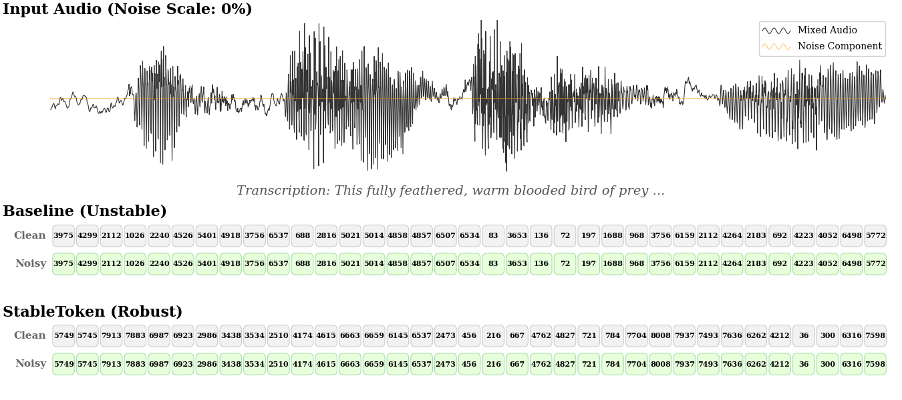

<div align="center">


# (ICLR 2026) StableToken: A Noise-Robust Semantic Speech Tokenizer for Resilient SpeechLLMs

### WeChat AI

<br>

<!-- Badges -->
<p>
<a href="https://arxiv.org/abs/2509.22220"></a>
&nbsp;
<a href="LICENSE"></a>
&nbsp;
<a href="https://huggingface.co/tencent/StableToken"></a>
</p>

<br>

<!-- Highlight Box -->
<table>
<tr>
<td>
<h3>🏆 State-of-the-art noise robustness — 60% lower UED than best existing supervised semantic tokenizers</h3>
</td>
</tr>
</table>



</div>

**Stability Comparison**: As noise scale increases from 0% to 100%, StableToken maintains highly stable token sequences (bottom), while baseline tokenizer (middle) shows significant instability and jitter.

<br>

<!-- News -->
## 📢 News

| Date | News |
|:-----|:-------|
| **2026-02-28** | 🚀 Initial release of StableToken on [GitHub](https://github.com/Tencent/StableToken) and [HuggingFace](https://huggingface.co/tencent/StableToken)! |
| **2026-01-26** | 📑 Our paper has been accepted to ICLR 2026! |

<br>

---

## 💡 Why StableToken?

Existing semantic speech tokenizers suffer from **critical instability** in noisy environments, causing downstream SpeechLLMs to generate inconsistent or erroneous outputs when processing real-world audio.

**StableToken solves this** through two key innovations:

*   🗳️ **Voting-LFQ**: A novel multi-voter quantization mechanism that achieves robust consensus under noise
*   🔊 **Noise-Aware Consensus Training**: A multi-branch training paradigm that enhances representational stability by achieving a global consensus between noisy and clean branches

This results in:

*   ✅ **2.5× more stable** than existing tokenizers (UED: 10.17% vs 26.17%)
*   ✅ **High-quality speech reconstruction** from discrete tokens
*   ✅ **Seamless integration** with downstream LLMs
*   ✅ **Superior downstream performance** for SpeechLLMs on noisy audio

---

## 🚀 Quick Start

### Installation

```bash
git clone --recursive https://github.com/Tencent/StableToken.git
cd StableToken && pip install -r requirements.txt
```

<details>
<summary><b>Detailed Installation Guide Using Conda</b> (Click to expand)</summary> 

1. **Clone the repository with submodules**:

   ```bash
   git clone --recursive https://github.com/Tencent/StableToken.git
   cd StableToken
   ```

   If you have already cloned without `--recursive`:

   ```bash
   git submodule init
   git submodule update
   ```

2. **Create a conda environment**:
   ```bash
   conda create -n stabletoken python=3.10.13 -y
   conda activate stabletoken
   ``` 

3. **Install dependencies**:
   ```bash
   conda install -c conda-forge libsndfile -y
   pip install -r requirements.txt
   ```

</details>

### Download Model

Using huggingface-cli:

```bash
huggingface-cli download tencent/StableToken --local-dir checkpoints/StableToken
```

Or using Python:

```python
from huggingface_hub import snapshot_download
snapshot_download(repo_id="tencent/StableToken", local_dir="checkpoints/StableToken")
```

### Run Inference

```bash
python example_usage.py \
    --device auto \
    --model_path checkpoints/StableToken \
    --audio_path /path/to/audio.wav
```

**Command Line Arguments:**

| Argument | Type | Default | Description |
|:---|:---|:---:|:---|
| `--device` | `str` | `auto` | Device for inference (`auto`, `cpu`, `cuda`, `cuda:0`, etc.) |
| `--model_path` | `str` | **Required** | Path to the model directory |
| `--audio_path` | `list[str]` | **Required** | Path(s) to input audio file(s) |


**Example Command:**

```bash
python example_usage.py \
    --device cuda \
    --model_path checkpoints/StableToken \
    --audio_path sample_en.wav sample_zh.wav
```

**Example Output:**

```text
================================== Arguments ===================================
Using device: cuda
Model path: checkpoints/StableToken
Audio path: ['assets/sample_en.wav', 'assets/sample_zh.wav']
--------------------------------------------------------------------------------

================================= Tokenization =================================
[1/2] `sample_en.wav` Generated 443 tokens:
[2963, 3232, 3236, 3556, 3301, ...]
--------------------------------------------------------------------------------
[2/2] `sample_zh.wav` Generated 381 tokens:
[3283, 7271, 7239, 5214, 5183, ...]
--------------------------------------------------------------------------------

================================ Reconstruction ================================
[1/2] Reconstructed audio saved to: `reconstruction/sample_en.wav`
[2/2] Reconstructed audio saved to: `reconstruction/sample_zh.wav`
--------------------------------------------------------------------------------
```

---

## 💻 Usage

### Python API

For a complete runnable example, please refer to [`example_usage.py`](example_usage.py). Below is a simplified example of using the core components:

```python
import os
from transformers import WhisperFeatureExtractor
from src.model.modeling_whisper import WhisperLFQEncoder
from src.utils.flow_inference import AudioDecoder
from src.utils.utils import extract_speech_token, speech_token_to_wav

# 1. Load Models
model_dir = "path/to/model"
tokenizer = WhisperLFQEncoder.from_pretrained(os.path.join(model_dir, "tokenizer")).eval().cuda()
feature_extractor = WhisperFeatureExtractor.from_pretrained(os.path.join(model_dir, "tokenizer"))

decoder = AudioDecoder(
    config_path=os.path.join(model_dir, "decoder", "config.yaml"),
    flow_ckpt_path=os.path.join(model_dir, "decoder", "flow.pt"),
    hift_ckpt_path=os.path.join(model_dir, "decoder", "hift.pt"),
    device="cuda"
)

# 2. Tokenize
tokens = extract_speech_token(tokenizer, feature_extractor, ["audio.wav"], device="cuda")[0]

# 3. Reconstruct
tts_speech, sampling_rate = speech_token_to_wav(decoder, tokens)
```

### Supported Audio Formats

We recommend using **WAV** format. However, StableToken supports all audio formats compatible with [`torchaudio`](https://github.com/pytorch/audio) (including `.flac`, `.mp3`, etc.).

---

## 📊 Performance

StableToken achieves **state-of-the-art noise robustness** while maintaining high reconstruction quality.

### Noise Robustness

| Model | Frame Rate | Codebook Size | Noise Robustness (UED%, ↓) |
|:---|:---:|:---:|:---:|
| [GLM-4-Voice-Tokenizer](https://github.com/zai-org/GLM-4-Voice) | 12.5Hz | 16,384 | 31.10 |
| [S3 Tokenizer](https://github.com/FunAudioLLM/CosyVoice) | 25Hz | 4,096 | 26.17 |
| [CosyVoice2](https://github.com/FunAudioLLM/CosyVoice) | 25Hz | 6,561 | 38.66 |
| **StableToken** | 25Hz | 8,192 | **10.17** 🏆 |


> [!NOTE]
> **UED (Unit Edit Distance)** measures the edit distance between token sequences from clean and noisy audio. Lower UED indicates better noise robustness. StableToken achieves **60% UED reduction** over the best existing supervised semantic tokenizer.

#### Run UED Evaluation

Before running the evaluation, you need to prepare a parquet file containing paired clean and noisy audio data. You can use the [audiomentations](https://github.com/iver56/audiomentations) library to add noise to clean audio samples.

> [!TIP]
> **Data Format**: The current code in `ued.py` expects the parquet file to contain specific columns: `'audio_en_clean'`, `'audio_en_noise'`, `'audio_zh_clean'`, and `'audio_zh_noise'`. You can easily modify the column names in the script to match your custom dataset structure.

```bash
python ued.py \
    --model_path checkpoints/StableToken \
    --parquet_files /path/to/data.parquet \
    --output_file ./UED_results/ued_results.json
```

### Speech Reconstruction

Measurements of Word Error Rate (WER, ↓) and Mean Opinion Score (MOS, ↑) on LibriSpeech (LS) and SEED benchmarks.

| Model | Frame<br>Rate | BPS | WER (↓)<br>LS-clean | WER (↓)<br>LS-other | WER (↓)<br>SEED-en | WER (↓)<br>SEED-zh | MOS (↑)<br>LS-clean | MOS (↑)<br>LS-other | MOS (↑)<br>SEED-en | MOS (↑)<br>SEED-zh |
|:---|:---:|:---:|:---:|:---:|:---:|:---:|:---:|:---:|:---:|:---:|
| [GLM-4-Voice-Tokenizer](https://github.com/zai-org/GLM-4-Voice) | 12.5Hz | 175 | 4.04 | 9.33 | 3.54 | 3.23 | 4.07 | **3.99** | **4.16** | 4.10 |
| [S3 Tokenizer](https://github.com/FunAudioLLM/CosyVoice) | 25Hz | 300 | 5.78 | 13.38 | 5.91 | 4.26 | 3.40 | 3.31 | 3.40 | 3.31 |
| [CosyVoice2](https://github.com/FunAudioLLM/CosyVoice) | 25Hz | 325 | 4.25 | 9.68 | 4.34 | 2.75 | 3.36 | 3.25 | 3.31 | 3.58 |
| **StableToken** | 25Hz | 325 | **3.84** | **7.99** | **3.44** | **2.62** | **4.09** | 3.83 | 4.01 | **4.18** |


---

## 🦁 Model Zoo

| Model | Frame Rate | Codebook Size | BPS | Download |
|:---|:---:|:---:|:---:|:---:|
| **StableToken** | 25Hz | 8,192 | 325 | [](https://huggingface.co/tencent/StableToken) |

---

## 🙏 Acknowledgements

We thank the authors of [GLM-4-Voice](https://github.com/zai-org/GLM-4-Voice) for their open-source code.

---

## 📜 Citation

If you find StableToken useful for your research, please cite:

```bibtex
@article{song2025stabletoken,
  title={StableToken: A Noise-Robust Semantic Speech Tokenizer for Resilient SpeechLLMs},
  author={Song, Yuhan and Zhang, Linhao and Wu, Chuhan and Liu, Aiwei and Jia, Wei and Wang, Houfeng and Zhou, Xiao},
  journal={arXiv preprint arXiv:2509.22220},
  year={2025}
}
```

---

## 📄 License

This project is licensed under the [License Term of StableToken](LICENSE).
